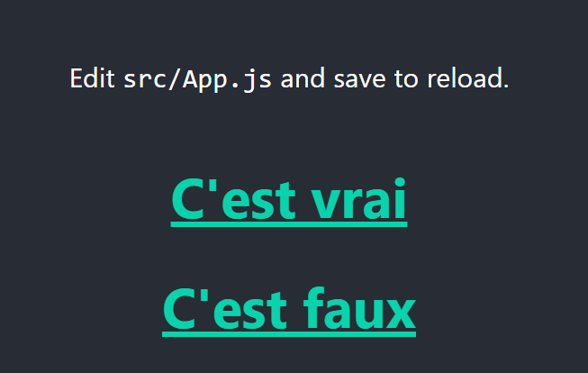
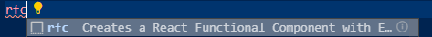
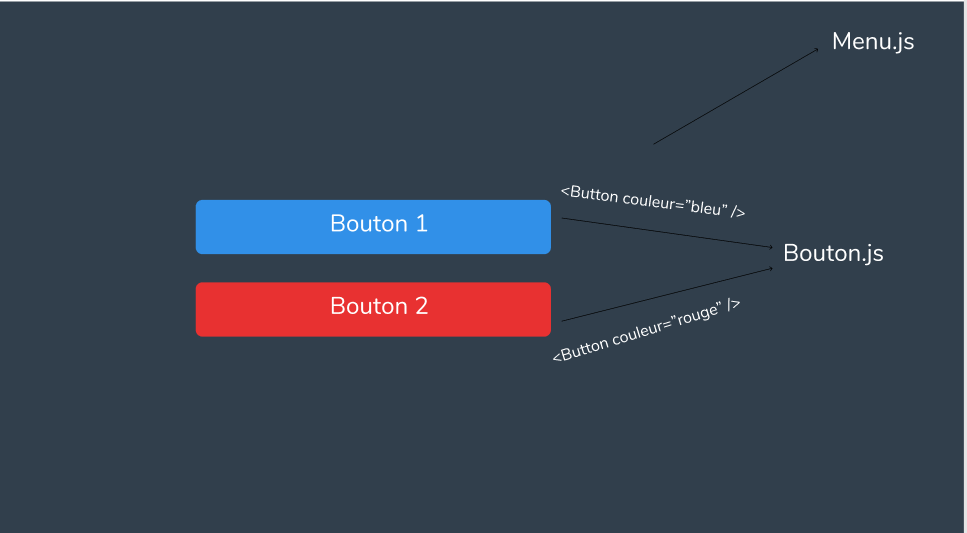

# Introduction React


## Mot clé

* React : librairie d'interface javascript
* JSX     : ce qui ressemble a l'html mais qui n'en est pas plus d'info <https://fr.reactjs.org/docs/introducing-jsx.html>
* npm : Node package manager (installation de module nodejs)

# Installation & outils


React tourne très bien sur navigateur web (comme un script javascript normal), mais pour commencer et pour simplifier le développement on vas utiliser un serveur de développement (rechargement et compilation direct,etc ...)

Donc pour faire tourné du JS sur un serveur (qu'il soit interpréter en dehors du navigateur)

il faut utiliser NODEJS, de plus il vient avec NPM (node package manager) qui permettra d'installer 

> <https://nodejs.org/en/> télécharger et installer

Ensuite dans la console taper

```bash
node -v
```

Si tout vas bien la commande vous retourne votre numéro de version de nodejs.


Pour revenir au package (avec NPM), il vont permettre d'installer des ajout (comme les jar quoi ) qui vont permettre de faciliter et/ou d'optimiser le développements des application.

Par exemple il y a le module *MYSQL* qui permet de se connecter au base de donnée et d'effectuer des requête (comme sgbd java).

Il peut permettre également d'ajouter des commande au système d'exploitation.


# Les bases

Ducoup on vas installer *create-react-app* qui permet de générer un projet react sans se faire chier avec la configuration.

Ducoup, faut ouvrir un terminal et installer le module avec

```shell
npm -g install create-react-app
```

> ici option -g pour installer en global (accessible partout et pas que pour un projet)

un fois installer ouvrir un terminal ou vous voulez créer le projet puis taper la commande

```bash
create-react-app lenomdevotreprojet
```

Sa vas créer un nouveau dossier avec le projet générer


Donc 2 dossiers *public* et *src* :

* public : la ou le serveur vas interpréter votre code react pour le rendre en html/js (compréhensible par les navigateurs)
* src : contient le code REACT que l'on vas écrire 


Ensuite en dehors des dossier il faut retenir le fichier *index.js*, c'est le point d'entrer de l'application (en gros le public void main). C'est ici que on peut définir quelles fichiers doit être rendu en html

```JSx
import React from 'react';										//1
import ReactDOM from 'react-dom';
import App from './App';										//2
import * as serviceWorker from './serviceWorker';				//optionnel

ReactDOM.render(<App />, document.getElementById('root'));		//3			

// If you want your app to work offline and load faster, you can change
// unregister() to register() below. Note this comes with some pitfalls.
// Learn more about service workers: https://bit.ly/CRA-PWA
serviceWorker.unregister();										//optionnel
```

Voila le fichier index.js:

 * ligne 1 : Ici on import les fonctionnalité du module *REACT* (comme le include en Java) ici le mot 

   clée *import* nous permet d'inclure des module ou fichier externe dans un composant de notre application

   > exemple de import

   ```jsx
   import nomQuejeVeux from 'lenomdumodule';
   import nomQuejeVeux from './laracinedemonfichierexterne';  //attention fichier externe 													doit étre présent dans le dossier src
   ```

   <b> A retenir from 'aaa' un module et from './aaa' un fichier (le path vers le fichier commence par ./ si il est dans le même dossier ou dossier supérieur ou ../ si dossier inférieur</b>

   exemple 

   dossier 2

   ​	>	fichier 3

    dossier1

   ​	>	fichier1 

   ​	>	 fichier2

```jsx
// dans fichier 1
import fichier3 from '../dossier2/fichier3' //en niveau en arriére
import fichier2 from './fichier2'			//même niveau
```


* ligne 2: on inclue le fichier App.js (on le voit juste après)
* ligne 3 : on fait le rendue du fichier App.js dans le navigateur 


On suite dans le dossier *src* on vas se focaliser sur le fichier App.js, (les fichiers css et images c'est des trucs basic voila voila)


```jsx
import React from 'react';			
import logo from './logo.svg';		
import './App.css';					//utilisation du css sur le component

function App() {					// function javascript basique
  return (							// retourne du code jsx
    <div className="App">
      <header className="App-header">
        
        <p>
          Edit <code>src/App.js</code> and save to reload.
        </p>
        <a
          className="App-link"
          href="https://reactjs.org"
          target="_blank"
          rel="noopener noreferrer"
        >
          Learn React
        </a>
      </header>
    </div>
  );
}

export default App;				// declare que la fonction app est utilisable en dehors 									de ce fichier

```

Le fichier App.js, ici on remarque deux élément important *function App()* et *return (...)*

* function App() : est le corp de notre composant 
* return(...)          : contient le code JSX (expliqué après)

# lancer l'application

A la racine de votre projet ouvrez une console et taper la commande

```shell
npm start
```

sa va démarrer le serveur de développement et ouvrir une page de navigateur avec votre application react.

Le serveur et un mode rechargement automatique, essayer de modifier du texte dans App.js puis sauver sauvgarder le fichier, vous pouvez remarquer que la page c'est actualiser toutes seule


# JSX vs Html

Jsx malgré ses fortes ressemblance avec html n'a rien a voir avec ce dernier.

Cependant l'écriture et quasiment identique les deux principale différence sont : 

* class en html = className en JSX
* toutes les balise doivent être auto fermant < b /> au bien avoir une balise qui'l la ferme < div > < div/ >

Le JSX permet également de (rendre du code javascript) dans de l'html et d'inclure une logique de rendu,

dans le JSX les instruction/ code JS est noté entre { } 


> petit exemple

```jsx
import React from 'react';			
import logo from './logo.svg';		
import './App.css';					

function App() {					
  let variableAlaCon = "je suis une variable" //on déclare une variable (javascript 																				basique)
  return (							
    <div className="App">
      <header className="App-header">
        
        <p>
          Edit <code>src/App.js</code> and save to reload.
        </p>
        <a
          className="App-link"
          href="https://reactjs.org"
          target="_blank"
          rel="noopener noreferrer"
        >
          {variableAlaCon} 				   {/* on l'affiche dans le navigateur  */}
        </a>
      </header>
    </div>
  );
}

export default App;				// declare que la fonction app est utilisable en dehors 									de ce fichier

```

<b> A noter commentaire en JSX {/* commentaire */} </b>


*Voila un utilisation très basique du JSX*


Maintenant un truc plus pratique et plus cool le rendue conditionnel.

Il s'écrit comme un opérateur ternaire :

```js
{condition ? on fait ça si vrai : on fait ça si faux}
```

Il vas permettre de rendre du contenue différent sur la page on fonction de condition 

```jsx
import React from 'react';
import logo from './logo.svg';
import './App.css';

function App() {
  let conditionVrai = true; //on déclare une variable 
  return (
    <div className="App">
      <header className="App-header">
        
        <p>
          Edit <code>src/App.js</code> and save to reload.
        </p>
        <a
          className="App-link"
          href="https://reactjs.org"
          target="_blank"
          rel="noopener noreferrer"
        >
              
          {conditionVrai ?
            <h1> C'est vrai </h1>
            :
            <h1>N'apparaitera pas sur la page </h1>
          }		   {/* on test conditionVrai == vrai */}


          {!conditionVrai ?
            <h1>Apparaitera pas sur la page </h1>
            :
            <h1> C'est faux </h1>
          }		   {/* on test conditionVrai == faux */}


        </a>
      </header>
    </div>
  );
}

export default App;		
```

Ce qui nous donne 



# Les props

Les props c'est simplement des attribut associée a un composant

Exemple avec de l'html

```html
<div class="salut" id="salutId">
    ...
</div>
```

si on donnerait les props de la div il serait class et id (ce sont en quelque sortes des paramètres ).


## Mise en œuvre des props avec JSX

 Avant aller dans Extension sur Vscode et installer *ES7 React/Redux/GraphQL/React-Native snippets* 


Il permet de générer des bouts de code react en tapant simplement des mot clée.

Ensuite dans le dossier src créer un nouveau fichier *MonComposant.js*

est écrivait *rfc* puis entrer

 

Ce qui nous génére

```jsx
import React from 'react'

export default () => {
    return (
        <div>
            
        </div>
    )
}
```

Moi c'est différent car j'ai modifier l'extension mais noté que :

```jsx
function test (paramétres) {

}
// est ma même chose que
let test = (paramétres) => {

}
// ce qui avec le export (on mais pas de nom ici car une seule chose a exporter)
export default (paramétres) => {
    return (
        <div>
            
        </div>
    )
}
```

donc maintenant dans App.js nous allons importer notre nouveau composant

```jsx
import React from 'react';
import './App.css';
import MonComposant from './MonComposant'			// j'importe mon composant
function App() {
  return (
    <div className="App">
      <h1> composant app</h1>
      {/* j'ai suprimmer le reste pour que ce soit plus claire */}
    </div>
  );
}

export default App;		
```

ici j'ai juste importer mon composant dans app.

Ensuite ajoutant une balise < h1 > dans mon composant avec du texte.


Maintenant affichons notre composant dans App.js

```jsx
import React from 'react';
import './App.css';
import MonComposant from './MonComposant'			// j'importe mon composant
function App() {
  return (
    <div className="App">
      <h1> composant app</h1>
      <MonComposant />
    </div>
  );
}
export default App;		
```

 ici j'ai juste ajouté une balise avec le nom de MonComposant

ce qui nous donne maintenant


Maintenant ajoutons un props texte a notre composant

>  Les props peuvent avoir n'importe quelle nom (a part quelque mot clé)

```jsx
import React from 'react';
import './App.css';
import MonComposant from './MonComposant'			// j'importe mon composant
function App() {
  return (
    <div className="App">
      <h1> composant app</h1>
      <MonComposant texte="je suis un texte de MonComposant" />
    </div>
  );
}
export default App;		
```

Maintenant faisons on sorte que MonComposant puisse récupérer les valeurs des props

```jsx
import React from 'react'

export default (props) => {				//on ajoute le paramétre props dans notre fonction
    return (
        <div>
            <h1>{props.texte}</h1>		{/* on rend le contenue du props texte */}
        </div>
    )
}

```


L'avantage des props est de pouvoir créer des composant réutilisable on pouvant changer leurs comportement/ contenue avec simplement des props 


ce qui nous permet de faire

```jsx
import React from 'react';
import './App.css';
import MonComposant from './MonComposant'			// j'importe mon composant
function App() {
  return (
    <div className="App">
      <h1> composant app</h1>
      <MonComposant texte="je suis un texte de MonComposant" />
      <MonComposant texte="je suis un texte n°2 de MonComposant" />
    </div>
  );
}
export default App;		
```

Ce qui présente un des principale concept de react qui est la séparation du code un plusieurs morceaux

qui sont réutilisable et adaptable n'importe dans l'application. Ce qui permet de séparer chaque élément de la page un plusieurs petit élément indépendant (code plus facilement débugable et plus claire)

> Exemple de code splitting



# Le styllling avec React

Il existe différente façon de créer des styles avec REACT.

Je vais vous présentez les 2 plus communes (et pratique).

Les feuille de style que nous allons écrire sont juste des fichier CSS basique (rien de nouveau là).

Donc les deux types de style que nous allons voir sont:

* le css global (j'ai inventé le nom y'en a pas qui existe en gros css avec un comportement normal)
* le css module : ce qui vas nous permettre d'assigner un style qui n'affectera que un composant de notre code sans affecter le style global


Commençons par créer un nouveau fichier css testStyle.css

et ajouter le code :

```css
.textcouleur {
    color : red;
}
```

et ensuite importons le dans App.js

en ajoutant simplement:

```css
import './testStyle.css'
<h1 className= "textcouleur"> composant app</h1> {/* et on ajoute la classe a notre composant */}
```


On vient ici de déclarer un style global, il affectera donc tout les éléments présent dans notre code avec le classname textcouleur.

Mais imaginons on veuille que notre composant MonComposant est un style bien particulier et que cela n'affecte pas le reste de notre application ? 

C'est là que rentre en jeux les css Modules !

Maintenant créons un nouveau fichier MonComposant.module.css en ajoutant le code suivant

```css
.textcouleur {
	color: green;
}
```

Maintenant pour dire a notre composant que notre fichier css est un css Module nous devons l'importé de la façons suivante.

```jsx
import lenomqueJeVeux (souvent on mais style) from './MonComposant.module.css'

// et on ajoute dans notre h1
 <h1 className = {style.textcouleur}>{props.texte}</h1> // on ajoute lenomqueJeVeux.textcouleur qui fait référence a la variable déclaré dans le fichier css au dessus
```

Et la on peut remarquer que les deux régles css ne rentre pas en conflit (la dernière déclaré ne prend pas le dessus sur l'autre ).

Le concept des css module vas permettre d'écrire des style plus facilement maintenable et débeugable car chaque petit composant aura un style associé (donc pas de conflit entre eux )


## <b> :warning: Je vous expliquerai les évenements en react (important a connaitre)</b>


# Les variables d'état STATE

:warning: <b> Je vous fait une version sans les classes (remplacer par les dernière mis a jour mais peut encore être utilisé) </b>

Les state sont grossièrement des variable mais qui peuvent être mise a jour et leur mise a jour affecterons tout les composant qui l'utiliserons.


Nous allons pour cela utilisé une fonctionnalité de REACT appelé les HOOKS.

On peut les voir comme des fonction particulières qui permettrons de mettre a jour des variable (hook d'état) ou bien de exécuter dans des condition particulière (hook d'effet).

## Les HOOK d'état

Les hook d'état, comme j'ai précisé plus haut vont permettre de définir des état a notre composant qui vont affecter sont comportement (on gros actualiser des petite partie de notre composant sans actualiser notre pas en entier).

### Comment définir un hook d'état

React nous propose la fonction useState() qui vas nous permettre de définir des variables d'état sur nos composant.

Elle se présente de la façons suivante :

```jsx
import react,{ useState} from 'react';

const[maVariableEtat,modificateurDeMaVariableEtat] = useState(mavaleurparDefaut)
```

 Elle se présent en 3 partie : 

	* maVariableEtat : la variable d'état qui vas contenir maValeur par défaut au début
	* modificateurDeMaVariableEtat : qui est une fonction qui vas me permettre d'actualiser mon état


a suivre ...